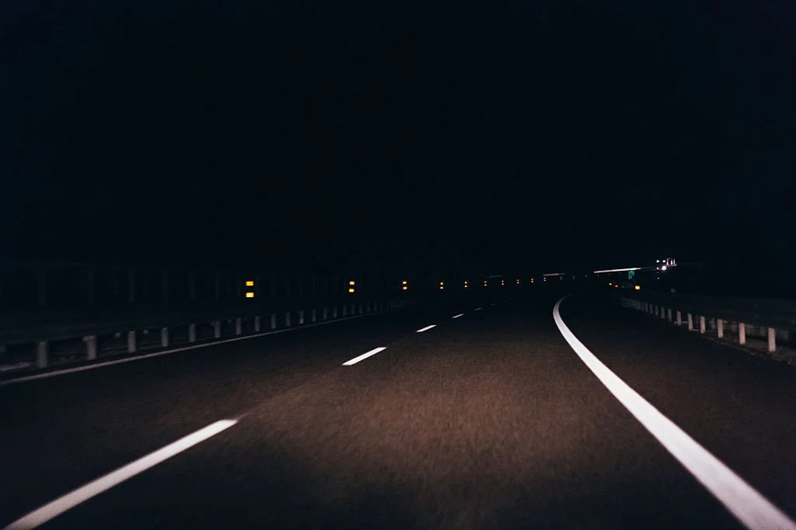
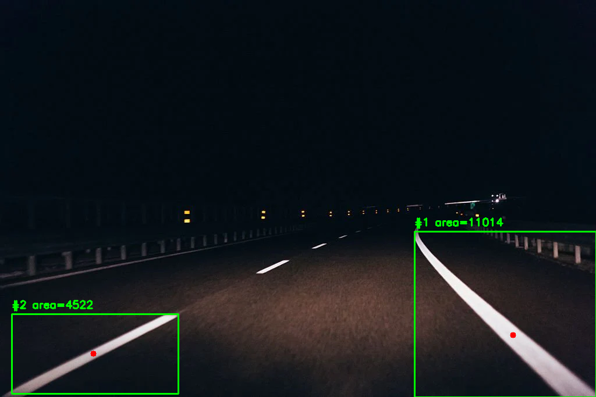
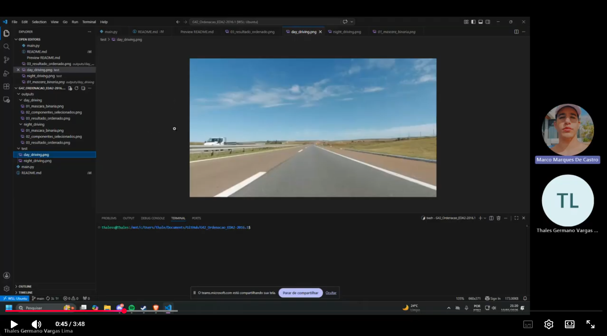

# Algoritmos de Ordenação

**Número da Lista:** 02  
**Disciplina:** FGA0030 - Estruturas de Dados e Algoritmos II  
---

## Integrantes

  
  

| Matrícula   | Aluno           |
|------------|-----------------|
| 20/2017147 | Thales Germano  |
| 21/1062197 | Marco Marques   |

## Sobre

Este projeto apresenta uma aplicação prática de algoritmos de ordenação no contexto de visão computacional automotiva, mais especificamente no tratamento de máscaras de faixas de pista.

O algoritmo utilizado tem finalidade demonstrativa. Em uma aplicação real, a extração eficiente e assertiva de máscaras de faixas exigiria etapas adicionais de pré-processamento, filtragem de ruídos, segmentação e validação dos componentes detectados.

A proposta consiste em processar imagens armazenadas na pasta `test`, realizar a binarização dessas imagens, identificar os componentes conectados presentes na máscara e ordenar esses componentes de acordo com sua área. Para isso, foi utilizado o algoritmo **Merge Sort**, ordenando os componentes do maior para o menor.

Essa abordagem simula uma etapa comum em sistemas de assistência à condução, como o **Lane Keeping Assistant (LKA)**, em que é necessário identificar as regiões mais relevantes de uma máscara de segmentação para selecionar possíveis faixas da pista e descartar pequenos ruídos.

O algoritmo realiza as seguintes etapas:

1. Leitura das imagens da pasta `test`;
2. Conversão da imagem para escala de cinza;
3. Binarização da imagem;
4. Extração dos componentes conectados;
5. Cálculo da área de cada componente;
6. Ordenação dos componentes por área usando Merge Sort;
7. Seleção dos maiores componentes;
8. Geração de imagens de saída com os resultados visuais.

---

## Algoritmo utilizado

O algoritmo de ordenação utilizado foi o **Merge Sort**.

O Merge Sort é um algoritmo baseado na técnica de divisão e conquista. Ele divide a lista de elementos em partes menores, ordena essas partes recursivamente e depois as intercala em uma lista final ordenada.

Neste projeto, os elementos ordenados são os componentes conectados encontrados na imagem. Cada componente possui uma área, e essa área é usada como critério de ordenação.

A ordenação é feita em ordem decrescente, ou seja, os maiores componentes aparecem primeiro.

---

## Exemplo de execução

Exemplo utilizando a imagem `night_driving`, localizada na pasta `test`.

| Imagem de entrada | Resultado do algoritmo |
|---|---|
|  |  |

## Apresentação

  

  

    Autores: 
    <a href="https://github.com/thalesgvl">Thales Germano Vargas Lima</a> & 
    <a href="https://github.com/marcomarquesdc">Marco Marques</a>
  

